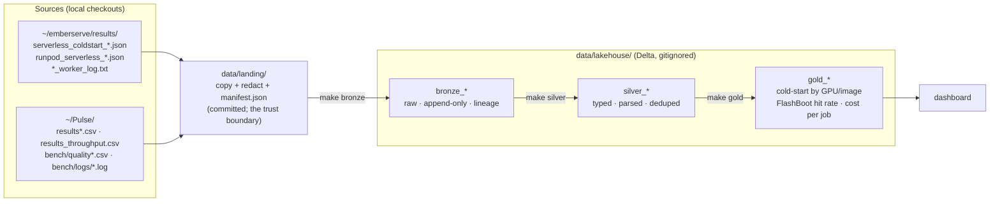

# serverless-lakehouse

A bronze → silver → gold (medallion) lakehouse over my own Runpod Serverless benchmark data: cold-start
timelines, load sweeps, per-request latencies, worker logs and LLM scoring-job results collected while
building [emberserve](https://github.com/ashwinsreedhar28/emberserve) (an LLM inference engine, formerly
*pagedserve*) and the Pulse scoring benchmark. Local PySpark + Delta Lake on an M1; nothing here needs a GPU.

The end state is a gold layer that answers: cold-start distribution by GPU and image, FlashBoot hit rate,
cost per job, and how emberserve compares to worker-vllm on the same endpoints.

**Status:** landing → bronze → silver → gold built and verified, plus two dashboards over gold: a static
`docs/dashboard.html` (served as a public Hugging Face Space from `space-static/`, and usable offline) and a Streamlit
app in `space/` for local use. `docs/gold_report.md` is the same gold layer as markdown.

## Architecture



Each arrow is one `make` target and one Python module, and every layer can be rebuilt from the one before
it. `data/landing/` is in git so a clone reproduces every table from `make bronze` alone. The landing path is a
local filesystem path today (`pathlib`, plain file reads); pointing it at object storage would mean reading
landing files through Spark or `fsspec` instead of `Path.read_text` — a contained change, listed under future work,
not something the current code does.

## Quickstart (macOS, Apple Silicon)

```bash
brew install openjdk@17                      # Spark 3.5 runs on Java 11/17 (21 works for local mode)
export JAVA_HOME="$(brew --prefix openjdk@17)"; export PATH="$JAVA_HOME/bin:$PATH"   # brew's JDK is keg-only;
                                             # the Makefile also detects it, so this is only needed outside make
git clone https://github.com/ashwinsreedhar28/serverless-lakehouse && cd serverless-lakehouse
make setup                                   # .venv with pyspark==3.5.9, delta-spark==3.3.3
make hooks                                   # pre-commit secrets scan
make all RUN_LABEL=2026-10-02_initial        # bronze → verify → silver → gold → report → dashboard
make space                                   # the Streamlit dashboard on localhost:8501
```

Or step by step: `make bronze` (landing → bronze; the first run fetches the Delta jars from Maven), `make verify`
(every landed file's rows are in its table, counted independently of Spark), `make silver`, `make gold`, `make report`.

`make land` re-extracts from `~/emberserve` (falls back to `~/pagedserve`) and `~/Pulse`; it is only needed
when the sources change. `FORMAT=parquet` runs the same code without the Delta extension, for sandboxes
that cannot reach Maven Central.

## Dashboard

`make dashboard` exports the gold tables once and feeds two pages from the same snapshot:

- **Static page** (`docs/dashboard.html`): the gold JSON embedded in one self-contained HTML file with SVG charts;
  opens from disk or GitHub Pages, no dependencies. This is what the **Hugging Face Space** serves
  (`space-static/`, static SDK — the free tier; Docker and Gradio Spaces need an HF PRO plan). From a laptop:
  `make space-login` once (browser code flow), then `make space-create HF_SPACE=<hf-username>/serverless-lakehouse`
  creates the Space (idempotent) and uploads the page as `index.html`; afterwards the GitHub Action
  (`.github/workflows/sync-space.yml`) re-uploads it whenever `docs/dashboard.html` changes on `main`, given an
  `HF_TOKEN` secret and an `HF_SPACE` variable on the GitHub repo. `make space-push` does the upload by hand.
- **Streamlit app** (`space/`): `space/app.py` + `space/data/gold.json`, Altair charts, no Spark; it only draws what
  gold says. Run it locally with `make space` (localhost:8501). It is also packaged as a Docker-SDK Space
  (`space/Dockerfile`, port 7860; `make space-create-docker` / `make space-push-docker`) for an account with HF PRO.

Both show: every cold start as a dot per engine and weights mode (log scale, FlashBoot hits hollow), worker-vllm's
boot phases stacked per log, the engine comparison with its cohorts, fast cold responses (the FlashBoot proxy), $ per cold start (request-duration proxy), $ per
1,000 scored articles, and TTFT against request rate for the Serverless sweeps.

## Layout

```
Makefile                    setup · land · bronze · verify · silver · gold · report · dashboard · space · space-push · all · show · check-secrets · hooks · test · test-fast · clean
requirements.txt            pinned: pyspark 3.5.9, delta-spark 3.3.3 (these two move together)
lakehouse/
  config.py                 paths and table names
  redact.py                 credential patterns, shared by land and the pre-commit scan
  land.py                   extract: source checkouts → data/landing/ (+ manifest.json)
  spark.py                  one SparkSession builder (delta | parquet)
  bronze.py                 data/landing/ → bronze tables
  verify.py                 bronze row counts vs. an independent Python count of each landed file
  silver.py                 bronze + seeds/ → typed, parsed, deduplicated silver tables
  gold.py                   silver → aggregate tables, one question each
  report.py                 gold → docs/gold_report.md
  dashboard.py              gold → docs/dashboard.html (static) + space/data/gold.json (for the Space)
  templates/dashboard.html  the static page; SVG charts drawn in the browser from the embedded JSON
  show.py                   what is in bronze
space-static/               the Hugging Face Space (static SDK): README.md (Space card); index.html = docs/dashboard.html, copied at upload
space/                      Streamlit app: app.py, requirements.txt, Dockerfile, README.md (Docker Space card), data/gold.json — local via `make space`
.github/workflows/          ci.yml — pytest + gitleaks on every push; sync-space.yml — uploads the static dashboard to the Space when it changes (needs HF_SPACE set)
seeds/                      hand-curated dimensions: coldstart_series.csv (engine/model/GPU/FlashBoot per series),
                            gpu_labels.csv (tier, GPU model, $/hr per label), coldstart_run_notes.csv (host state per run),
                            coldstart_request_overrides.csv (GPU placement that differed from the typed label);
                            seeds/evidence/ holds the console notes they were read from — facts the machine-written sources lack
docs/gold_report.md         the gold tables rendered as markdown by `make report`
docs/dashboard.html         the static dashboard rendered by `make dashboard`
scripts/check_secrets.py    scan tracked/staged files (index blobs, NUL-separated paths, bytes incl. UTF-16); exit 1 on any hit
scripts/audit_bundle.py     one file with every source + doc for an outside reviewer (audit/AUDIT_PROMPT.md is the brief)
.githooks/pre-commit        refuses .env / *.env / data/lakehouse paths, then runs check_secrets --staged
tests/                      redaction shapes; landing ↔ manifest consistency; seed CSV integrity; end-to-end snapshot
                            scenarios (revert, rename, empty file, ledger repair, partial ingest, --force); UTC rendering
data/landing/               47 redacted source files + manifest.json (committed, 2.6 MB)
data/lakehouse/             Delta tables (gitignored, rebuildable)
```

## Sources

What is in each source today, from inspecting the files — not from memory of what the scripts write.

| source | files | what one record is | fields worth knowing |
|---|---|---|---|
| `emberserve/results/serverless_coldstart_*.json` | 13 | a cold-start series: header + 1–3 `runs[]`, each a `cold`/`warm` request pair | `delay_ms`, `execution_ms`, `worker_id`, `health_before`; newer files add `phases_s` (9–12 phases) and `timeline.marks` |
| `emberserve/results/runpod_serverless_*.json` | 10 | a load sweep: header + `args` + one run per request rate | `ttft/tpot/e2e` p50/p90/p99, `throughput_tok_s`; 4 files carry `records[]` (200 per run, 1,000 rows total); load-balancer files add `server_counters` |
| worker logs (`Pulse/bench/logs/*.log`, emberserve `*_worker_log.txt`) | 18 | one log line | three timestamp prefixes (console copy-paste, API ISO-8601, endpoint-logs table); payload mixes vLLM INFO, httpx, Runpod SDK JSON, tqdm bars |
| `Pulse/results.csv`, `results_v0.csv`, `bench/logs/results_runs1-3.csv` | 3 | one `coldstart.py` request | `kind` cold/warm, `delay_ms`, `exec_ms`, `gpu`, `workers_before`; v0 schema lacks `finish_reason`,`text`; v0 and runs1-3 are byte-identical |
| `Pulse/results_throughput.csv` | 1 | one `throughput.py` request | `label` (prefix_on/off), `concurrency`, `delay_ms`, `exec_ms`, `score` |
| `Pulse/bench/quality.csv`, `quality_batches.csv` | 2 | one scored article / one batch | 8 backend×model combos (ollama, claude, openrouter, runpod A40 / RTX A6000), `est_cost_usd`, `rate_*` |

Deliberately **not** ingested: `Pulse/bench/logs/quality_*.log` (quality.py stdout; every field is already a
row in `quality*.csv`), `Pulse/bench/.env`, `Pulse/bench/logs/gpu_per_cycle.txt` and `run_script_outputs.txt`
(hand-written notes → a curated seed table in silver), emberserve `*.server.log` (A100 pod sweeps, not
Serverless), `articles_50.json` (the scoring fixture).

## Layer schemas

### Bronze — built

Every table has four lineage columns:

| column | meaning |
|---|---|
| `ingested_at` | UTC timestamp of the ingest run (one instant per run) |
| `run_label` | batch tag passed to `make bronze` |
| `source_file` | landed path, relative to `data/landing/` |
| `source_sha256` | sha256 of that landed file (from the manifest, re-verified at read time) |

| table | one row is | rows | columns besides lineage |
|---|---|---|---|
| `bronze_coldstart_series` | one `serverless_coldstart_*.json` file | 13 | `kind mode endpoint label image note max_tokens idle_s n_runs summary_json` |
| `bronze_coldstart_runs` | one cold+warm run in such a file | 31 | same header + `run_index health_before_json cold_json warm_json` |
| `bronze_sweep_runs` | one request-rate run in `runpod_serverless_*.json` | 38 | `kind system server base_url model args_json run_index request_rate wall_s summary_json trace_json server_counters_json server_latency_json n_records` |
| `bronze_sweep_records` | one request, where the sweep saved them | 1,000 | `system run_index request_rate request_id arrival_s first_token_s finish_s prompt_tokens output_tokens success error` |
| `bronze_worker_log_lines` | one line of a worker log | 9,367 | `line_no raw_line` |
| `bronze_pulse_coldstart_requests` | one row of `results*.csv` | 102 | the 17 CSV columns, all `string`; v0-schema rows have null `finish_reason`,`text` |
| `bronze_pulse_throughput_requests` | one row of `results_throughput.csv` | 2,795 | the 17 CSV columns, all `string` |
| `bronze_pulse_quality_requests` | one row of `quality.csv` | 700 | the 27 CSV columns, all `string` |
| `bronze_pulse_quality_batches` | one row of `quality_batches.csv` | 14 | the 23 CSV columns, all `string` |
| `bronze_ingest_log` | one (run, table, file) append | 64 | `run_label table source_file source_sha256 rows ingested_at` |

Typing rule: CSV values stay strings; JSON scalars keep their JSON type (`max_tokens` is a long because the
file says `16`, not `"16"`); JSON objects are stored as compact JSON strings and exploded in silver.

### Silver — built

Typed, parsed, deduplicated; one row per *event*; rebuilt in full from bronze + seeds on every run. Every row
carries bronze's `source_file` and `bronze_run_label`, plus `silver_built_at`.

| table | one row is | rows | what silver did to get it |
|---|---|---|---|
| `dim_coldstart_series` | one emberserve cold-start series | 13 | seed: engine, build, model, GPU, FlashBoot setting (+ how it is known), weights mode |
| `dim_gpu_label` | one GPU label as the sources spell it | 14 | seed: tier, GPU model where known, $/hr, `evidence` (observed / inferred / unknown) and its source |
| `dim_coldstart_request_overrides` | one Pulse request whose recorded GPU label was wrong | 3 | seed: run 7's three requests were served by an A40 on the 48 GB tier while `coldstart.py` was launched with `--gpu 24GBPRO-1.10`; silver keeps `gpu_label_raw` beside the corrected label |
| `dim_coldstart_run_notes` | one (series, run) with a fact the files don't carry | 7 | seed: `host_state` (fresh / warm / partial / FlashBoot resume) with `evidence` (author testimony / file note / author label) and its source; silver defaults every other run to `unknown` |
| `silver_coldstart_requests` | one Serverless request, cold or warm, from either source | 149 | emberserve `cold_json`/`warm_json` exploded with `from_json`; Pulse CSVs typed; the 15 duplicate rows of `results_v0.csv` ≡ `results_runs1-3.csv` dropped; model names canonicalised; joined to both dims; derived `is_flashboot_hit` (cold ∧ ok ∧ delay < 5 000 ms), `request_duration_s`, `est_cost_usd`; `host_state` from the run-notes seed; `source_sha256` kept on every row |
| `silver_coldstart_phases` | one (series, run, phase or timeline mark) | 307 | emberserve `phases_s` and `timeline.marks` maps exploded |
| `silver_sweep_summaries` | one request-rate run of a load sweep | 38 | summary/trace/args/server_latency JSON flattened to columns; `request_rate: null` → `inf` with `is_unbounded`; `endpoint_id` and queue vs load-balancer parsed from the URL |
| `silver_sweep_requests` | one request of a sweep | 1,000 | `ttft_ms`, `e2e_ms`, `tpot_ms`, `arrival_offset_s` from the monotonic-clock fields; null when the request failed |
| `silver_worker_log_events` | one worker-log line | 9,367 | three timestamp prefixes parsed to one UTC `ts_utc` (console copy-paste carries `GMT-0400`; the endpoint-logs export is laptop-local, converted from America/New_York); payload classified into `event_kind` ∈ {vllm, runpod_sdk, progress, httpx, wrapper, other}; `process_role`, `pid`, `level`, `request_id`, `message` extracted |
| `silver_scoring_requests` | one scored article | 700 | typed; empty strings → null; prices as doubles |
| `silver_scoring_batches` | one scoring batch | 14 | typed |

### Gold — built

| table | the question it answers | rows |
|---|---|---|
| `gold_engine_comparison` | same GPU (RTX 4090), same model (Qwen3-8B): full cold boot p50/mean/min/max, warm delay and exec, $ per cold start — emberserve baked vs fetched vs worker-vllm; `scope=pooled` rows plus one row per `cohort` (fresh host / warm host / partial host / FlashBoot resume / Pulse-era), with `n_undated` for boots whose file has no wall-clock timestamp | 12 |
| `gold_worker_boot_phases` | worker-vllm's boot anatomy from its own log lines: seconds to weights, `torch.compile`, CUDA-graph capture summed over its passes (+ `n_graph_passes`, `graph_mode`), `init engine`, start → API ready, ready → first job; one row per engine boot, `segmented_by` naming the line that opened it | 18 |
| `gold_flashboot_hit_rate` | fast cold responses (FlashBoot proxy): share of successful cold-labelled requests answered in under 5 s, per engine × endpoint × FlashBoot setting, with `n_cold_failed` (attempts the denominator excludes) and `n_resume_recorded` (the engine's own flag, where a file has one) | 15 |
| `gold_coldstart_by_gpu_image` | delay/exec distribution per engine × model × GPU × weights mode × FlashBoot × kind | 32 |
| `gold_cost_per_job` | request-duration cost proxy `(delay_ms + exec_ms) / 3.6e6 × $/hr` per engine × model × tier × kind, only where the tier price is known; not billed time | 16 |
| `gold_scoring_cost_per_batch` | $ and seconds per article for the Pulse scoring job, per backend × model | 14 |
| `gold_sweep_latency` | TTFT / e2e / throughput per system × request rate (`inf` = unpaced, capped by `max_concurrency` where set), with `served_model` and per-request p99 where records exist | 38 |
| `gold_coldstart_events` | every successful cold request, one row — the dashboard's dot plot, with `is_flashboot_hit` and `flashboot_resume_recorded` side by side | 47 |

Headline numbers today (`docs/gold_report.md`), Qwen3-8B on an RTX 4090, **pooled over every full boot**: a cold
boot is **17 s** with emberserve and baked weights (n=4), **38 s** with emberserve fetching weights at start (n=11),
and **210 s** with worker-vllm (n=6). The pooled worker-vllm figure mixes three cohorts, which the same table lists
separately: a fresh host that had to pull the image (210 s, n=1), two same-night reruns on a warm host (**147.5 s**
mean — the pair behind the Sep 30 write-up), and three Sep 23 Pulse-era runs (worker-vllm running vLLM v0.28.0 — the only engine version the Sep 23 logs name; the
Sep 30 series ran image v2.28.0 / vLLM v0.30.0 — with endpoint rollouts; 258 s median). Three of the six boots carry no
wall-clock timestamp in their file (`n_undated`), so the pooled row's `dates` covers only the Sep 23 half. A fourth Sep 23 request (177.5 s) carried the `24GBPRO-1.10` label but the placement
notes show it ran on an A40, so a per-request override moves it out of the RTX 4090 comparison. Inside a worker-vllm boot, `torch.compile` is 24–65 s and `init engine` 25–140 s;
CUDA-graph capture is 5–9 s per pass on the RTX 4090 / A100 / H100 boots (vLLM 0.30 runs two passes, 11–14 s per
boot; 0.28 runs one), 19–20 s for the 32B-AWQ model on an RTX A6000, and 74–81 s on the three Sep 23 boots on the
24 GB-tier GPU that was never identified — it tracks GPU and model, not vLLM version (nearly every boot captured both
FULL and PIECEWISE graphs; `graph_mode` is a column). The 18 logged boots include three whose export has no
`vllm serve` line (two in a console export that interleaves two workers, one log that starts mid-boot): their
per-phase seconds are real, their start-anchored deltas are null, and `segmented_by` says which. The two worker
logs with a warm compile cache show `torch.compile` at **1.1–1.3 s** instead of 44 s and start → API ready at 97 s
instead of 173 s. Medians are Spark `percentile_approx`: an observed value, no interpolation (the four baked-weight
delays are 16 208 / 17 156 / 17 717 / 328 385 ms, so p50 is 17 156, where an interpolated median would say 17 437;
on the six worker-vllm boots the convention matters more: 210 437 observed vs 226 715 interpolated).
These are observational cohorts — different builds, hosts, dates and endpoint settings — not a controlled
experiment, so they describe what happened, not an engine-only speed-up.

## Decisions

1. **Landing zone in git, lakehouse out of git.** The pipeline must be runnable by someone who is not me.
   `data/landing/` (2.6 MB, redacted, manifested) is that fixture; `data/lakehouse/` is derived and
   rebuildable. Threshold for moving landing to LFS or object storage: ~50 MB.
2. **Landing is a mirror; bronze is a ledger.** `make land` overwrites files and rewrites the manifest.
   History is bronze's job: append-only, every row stamped with `source_sha256`.
3. **Idempotency key = (source_file, source_sha256).** Re-running `make bronze` appends nothing. A changed
   file at the same path appends new rows beside the old ones. Two identical files at different paths both
   land (the source really has both); silver dedupes.
4. **Bronze flattens arrays, nothing else.** One row per `runs[]` / `records[]` element is a grain choice,
   not a transform — a one-row-per-file table with nested arrays is unqueryable. Nested objects stay JSON
   strings so a new phase name in a future file cannot break the schema (Delta `mergeSchema` is on for appends; in `FORMAT=parquet` mode
   `spark.sql.parquet.mergeSchema` is on for reads, since plain parquet has no table schema to merge into). Bronze
   also checks a CSV's header for the key columns its target table needs before appending — the manifest's dataset
   tag is a hand-written routing label, and a mis-tagged file must not land in the wrong table.
5. **Spark reads the CSVs with an explicit all-string schema** (`multiLine`, `escape='"'`, `FAILFAST`),
   and `make verify` recounts every file with Python's `csv`/`json`/`splitlines` — an independent oracle,
   so the pipeline is not grading itself.
6. **No partitioning in bronze.** Tables are KB–MB; partition directories would cost more than they save.
   Revisit at silver if a date partition helps the dashboard.
7. **Identifiers are not secrets.** Endpoint IDs, worker IDs and `api.runpod.ai/v2/<id>` URLs stay in the
   data: every call needs the Bearer key, and the same IDs are already public in emberserve's `results/`.
8. **Version pins move together.** `pyspark==3.5.9` ↔ `delta-spark==3.3.3`; Delta 3.3 is built for Spark 3.5.
9. **`request_rate: null` is kept null** in bronze (it means the unbounded/“inf” rate; Python's `json`
   wrote `null`). Mapping it to `inf` is a silver rule. Likewise the `NaN` literals two sweep files contain.
10. **pagedserve → emberserve.** The engine repo is being renamed; this repo uses the new name for the
    source root and falls back to `~/pagedserve` locally. File names and values inside the data keep the old
    name — bronze does not rewrite source content.
11. **Silver and gold are rebuilt in full (`overwrite`), bronze is never rewritten.** They are deterministic
    functions of bronze + seeds + the landing manifest; appending to them would only create a second dedupe
    problem. Silver selects each file's rows by the manifest's current (path, sha256) pair, never by "newest
    ingest": that handles a reverted file (A → B → A appends nothing, yet A is current), a replacement with no
    records, and a rename. If a manifest version is missing from bronze, silver stops and says `make bronze`.
    `tests/test_snapshot_scenarios.py` runs those cases end to end. (The first external audit found the
    newest-timestamp rule wrong on all three.)
12. **Facts the machines did not write live in `seeds/`, with their source and an evidence grade.** The GPU
    behind a tier label, the FlashBoot setting of a series, host state per run and $/hr were read off the Runpod
    console or run notes. Each seed row names where it came from and whether the value is `observed`, `inferred`
    or `unknown` (`evidence`, `flashboot_source`); the hand-written placement notes are committed as
    `seeds/evidence/gpu_per_cycle.txt`. Silver prints any label without a seed row instead of silently nulling
    it. Where the source does not establish the fact the value is `unknown`, not a guess: the FlashBoot setting
    of three series that merely share an endpoint with a labelled-off series, and the GPU behind the 24 GB tier.
    The 48 GB tier label was first seeded as A40 from its price; the audit caught that the same price also served
    an RTX A6000, and the worker logs for that endpoint are named `A6000`, so it is now `RTX A6000, inferred`.
    A label is also not hardware identity per request: `coldstart.py` took `--gpu` from the operator, and run 7
    was launched with a stale label while Runpod placed it on an A40. `seeds/coldstart_request_overrides.csv`
    corrects individual requests (keyed by endpoint and timestamp, compared as timestamps so a re-export that
    writes `Z` for `+00:00` still matches, `observed` evidence only); silver keeps `gpu_label_raw` beside the
    corrected `gpu_label`. A seed row that names an endpoint or series present in the data but matches no request
    stops the build — a silently defaulted override would put the A40 boot back into the RTX 4090 comparison.
13. **"FlashBoot hit" is a proxy: a *successful* cold-labelled request with `delay_ms` < 5 000.** Observed
    resumes are 0.5–1.9 s and the fastest full boot is 12.6 s, so the threshold is not sensitive. Denominator =
    successful cold requests; `n_cold_failed` sits beside it so a 100 % on one boot (the 32B endpoint: one 0.7 s
    response after a 274 s `FAILED` boot and three HTTP 403s) reads as 1-of-1-after-4-failures. One series file
    also records the engine's own `flashboot_resume: true`; silver keeps it as `flashboot_resume_recorded` (null
    where the file has no such field) and gold counts it as `n_resume_recorded`. It cannot distinguish a FlashBoot resume from a worker that was
    simply still warm (Pulse run 3 was one), so the table is titled "fast cold responses (FlashBoot proxy)".
14. **Cost is a request-duration proxy, not billed time.** `request_duration_s = (delay_ms + exec_ms) / 1000`,
    `est_cost_usd = request_duration_s / 3600 × price_per_hr_usd`. Runpod bills worker start, execution and idle
    phases per worker; a per-request sum includes unbilled queue time (over) and omits billed idle and startup
    outside the request (under), so it bounds nothing. It is a like-for-like comparison metric; the formula is a
    column in `gold_cost_per_job`. Rows without a known tier price get null, not a guess.
15. **Worker-log boot segmentation.** A boot opens at the wrapper's `Starting vLLM: vllm serve …` line (not vLLM's
    own `Starting vLLM server on http://…`, which comes ~2 min later), per worker where the export names one. vLLM
    prints exactly one `Initializing a V1 LLM engine` per engine start, so an init with no unmatched wrapper line
    before it on the same worker opens a boot too (a console export kept one wrapper line for three boots), and a
    log that starts mid-boot is a boot with no opener; `segmented_by` records which, and `t_start_vllm` is null
    rather than borrowed from a neighbouring boot. Phase durations are what vLLM printed (`torch.compile took 23.99 s`), not inferred from timestamps, except
    start → weights and start → API-ready, which are timestamp differences.
16. **Fresh-host rows stay in the distributions.** `*_fresh_host` series include the image pull on a host that
    has never run the image (328 s for the 27 GB baked image). They are real cold starts a user can hit; the
    series dimension marks them so a view can exclude them.
17. **A pooled median is labelled pooled, and its cohorts sit next to it.** `gold_engine_comparison` carries
    `scope` (`pooled` | `cohort`) and `cohort` (host state from the run-notes seed, else data era). The pooled
    worker-vllm 210 s and the 147.5 s in an earlier write-up are both right and cover different runs; a table
    that shows only one of them reads as a contradiction to anyone holding the other. Host state is a per-run
    fact that neither the files nor the series carry, so it lives in `seeds/coldstart_run_notes.csv` with a
    source per row; runs without a row are `unknown`, never guessed.

## Audit

Before publishing, the whole repo was handed to an external reviewer model (`scripts/audit_bundle.py` packs it;
`audit/AUDIT_PROMPT.md` is the brief). It found five blocking issues, all fixed and all now covered by tests or
wording: silver selected file versions by newest ingest instead of by the manifest (wrong on revert, rename and
empty replacement); `regexp_extract` returning `""` nulled every load-balancer endpoint id; a Streamlit percent
format; a Space deployment built on the deprecated Streamlit SDK and the removed `huggingface-cli`; and a cost
"upper bound" claim the billing model does not support. It also downgraded several seed values from asserted to
inferred or unknown and caught the A40/A6000 mix-up. A second pass on the fixed commit found three more: one
request whose recorded GPU label did not match its placement (now a per-request override), a private-key
redaction that removed only the PEM header (now the whole block), and a snapshot guard that accepted a run which
had written a sweep's summary but not its records (now checked per expected table, with zero-row ingests
counted through the ledger). It also showed `--force` re-ingests duplicating silver events and renamed files
lingering in landing; both fixed and covered in `tests/test_snapshot_scenarios.py`. A third pass found Spark's
Python workers following `PATH` instead of the venv (now pinned to the driver interpreter), dashboard timestamps
serialised in the driver's local zone without an offset (now rendered as UTC strings inside Spark), and empty
files re-ingested on every retry (zero-row ledger entries now count as ingested). A fourth, independent pass (a
fresh clone, no access to this conversation) reproduced every headline number from the raw landed files with its own
Python and then found five more: boot segmentation that merged two boots into one row and dropped two others (the
only A40 boot among them), `graph_capture_s` taking the larger of vLLM 0.30's two capture passes instead of their
sum, a "worker-vllm 2.27" claim no landed file supports, a pre-commit scanner that any filename git quotes could
walk past, and stale row counts in this file. All fixed; the scanner now reads NUL-separated paths and index blobs
and treats an unreadable blob as a finding. The audit reports themselves are gitignored (`audit/*.md`); the fixes
are the commits "Audit fixes", "Re-audit fixes", "Third-audit fixes" and "Fourth-audit fixes".

Future work: object-storage landing (read landing files through Spark/`fsspec`), a `dim_date` and date
partitions before the data grows, bronze schema migration for a JSON scalar that changes type (today the explicit
`StructType` raises), and recording GPU model, host state and FlashBoot at benchmark time so the seeds shrink. One writer at a time:
two concurrent `make silver` runs race on the same `_temporary/` directory and one dies with a Java
`FileNotFoundException` (no corruption — the survivor's tables are complete and a rerun recovers); there is no lock.

## Secrets

Worker logs can contain whatever the container printed, and sweep `args` carry an `api_key` field, so:

- `lakehouse/redact.py` holds one pattern list (HF `hf_…`, Runpod `rpa_…`, `sk-…` keys, GitHub classic and
  fine-grained tokens, AWS access keys, Slack tokens and webhooks, Google `AIza…`, Stripe `sk_live_…`, SendGrid
  `SG.…`, whole PEM private-key blocks, JWTs, `Bearer …`, `Basic …`, `user:password@` in URLs, `?key=`/`&token=`
  query parameters, and `key: value` forms whose key name contains `api_key|secret|token|password|authorization|
  credential`, compound names such as `AWS_SECRET_ACCESS_KEY` included — any value of 8+ characters that is not
  purely numeric and not a placeholder the source already wrote, such as vLLM's own `'hf_token': 'hf_REDACTED'`). `make land`
  applies it to every byte that enters the repo and records per-file redaction counts in the manifest
  (currently 0 — the sources were already clean; the `api_key` in sweep args is `"<redacted>"` at source).
- `.env` and `*.env` are refused by name in `land`, `.gitignore` and the pre-commit hook, whatever they contain.
- `make check-secrets` scans every tracked file with the same patterns; the pre-commit hook (`make hooks`)
  runs it on the staged index blobs, with NUL-separated paths (so a filename git would quote is still scanned),
  bytes decoded as UTF-8 and UTF-16, no suffix exemptions beyond images/parquet/pyc, and an unreadable blob
  counted as a finding. One pattern list means one blind spot shared by landing and the hook, so CI
  (`.github/workflows/ci.yml`) also runs **gitleaks**, an independent scanner with its own rules — after the push,
  so it guards the shared history, not the local commit. Together they catch the credential shapes in both rule
  sets — a bounded guarantee, not "nothing can leak".
- `tests/test_landing.py` asserts the committed landing zone matches its manifest byte-for-byte and contains no match.
