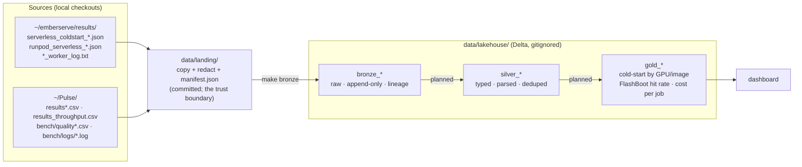

# serverless-lakehouse

A bronze → silver → gold (medallion) lakehouse over my own Runpod Serverless benchmark data: cold-start
timelines, load sweeps, per-request latencies, worker logs and LLM scoring-job results collected while
building [emberserve](https://github.com/ashwinsreedhar28/emberserve) (an LLM inference engine, formerly
*pagedserve*) and the Pulse scoring benchmark. Local PySpark + Delta Lake on an M1; nothing here needs a GPU.

The end state is a gold layer that answers: cold-start distribution by GPU and image, FlashBoot hit rate,
cost per job, and how emberserve compares to worker-vllm on the same endpoints.

**Status:** landing → bronze → silver → gold all built and verified; `docs/gold_report.md` is the rendered output.
Next: a dashboard page over the gold tables.

## Architecture



Each arrow is one `make` target and one Python module, and every layer can be rebuilt from the one before
it. `data/landing/` is in git so a clone reproduces every table from `make bronze` alone; in a deployed
version `LANDING_DIR` would be an S3 prefix and nothing downstream would change.

## Quickstart (macOS, Apple Silicon)

```bash
brew install openjdk@17                      # Spark 3.5 runs on Java 11/17 (21 works for local mode)
export JAVA_HOME="$(brew --prefix openjdk@17)"; export PATH="$JAVA_HOME/bin:$PATH"   # brew's JDK is keg-only;
                                             # the Makefile also detects it, so this is only needed outside make
git clone https://github.com/ashwinsreedhar28/serverless-lakehouse && cd serverless-lakehouse
make setup                                   # .venv with pyspark==3.5.9, delta-spark==3.3.3
make hooks                                   # pre-commit secrets scan
make all RUN_LABEL=2026-10-02_initial        # bronze → verify → silver → gold → docs/gold_report.md
make show                                    # rows / files / run_labels per bronze table
```

Or step by step: `make bronze` (landing → bronze; the first run fetches the Delta jars from Maven), `make verify`
(every landed file's rows are in its table, counted independently of Spark), `make silver`, `make gold`, `make report`.

`make land` re-extracts from `~/emberserve` (falls back to `~/pagedserve`) and `~/Pulse`; it is only needed
when the sources change. `FORMAT=parquet` runs the same code without the Delta extension, for sandboxes
that cannot reach Maven Central.

## Layout

```
Makefile                    setup · land · bronze · verify · show · check-secrets · hooks · test · clean
requirements.txt            pinned: pyspark 3.5.9, delta-spark 3.3.3 (these two move together)
lakehouse/
  config.py                 paths and table names
  redact.py                 credential patterns, shared by land and the pre-commit scan
  land.py                   extract: source checkouts → data/landing/ (+ manifest.json)
  spark.py                  one SparkSession builder (delta | parquet)
  bronze.py                 data/landing/ → bronze tables
  verify.py                 bronze row counts vs. an independent Python count of each landed file
  silver.py                 bronze + seeds/ → typed, parsed, deduplicated silver tables
  gold.py                   silver → aggregate tables, one question each
  report.py                 gold → docs/gold_report.md
  show.py                   what is in bronze
seeds/                      hand-curated dimensions: coldstart_series.csv (engine/model/GPU/FlashBoot per series),
                            gpu_labels.csv (tier, GPU model, $/hr per label) — facts the machine-written sources lack
docs/gold_report.md         the gold tables rendered as markdown by `make report`
scripts/check_secrets.py    scan tracked/staged files; exit 1 on any hit
.githooks/pre-commit        refuses .env / data/lakehouse paths, then runs check_secrets --staged
tests/                      redaction behaviour; landing zone ↔ manifest consistency; no secrets landed
data/landing/               47 redacted source files + manifest.json (committed, 2.6 MB)
data/lakehouse/             Delta tables (gitignored, rebuildable)
```

## Sources

What is in each source today, from inspecting the files — not from memory of what the scripts write.

| source | files | what one record is | fields worth knowing |
|---|---|---|---|
| `emberserve/results/serverless_coldstart_*.json` | 13 | a cold-start series: header + 1–3 `runs[]`, each a `cold`/`warm` request pair | `delay_ms`, `execution_ms`, `worker_id`, `health_before`; newer files add `phases_s` (9–12 phases) and `timeline.marks` |
| `emberserve/results/runpod_serverless_*.json` | 10 | a load sweep: header + `args` + one run per request rate | `ttft/tpot/e2e` p50/p90/p99, `throughput_tok_s`; 4 files carry `records[]` (200 per run, 1,000 rows total); load-balancer files add `server_counters` |
| worker logs (`Pulse/bench/logs/*.log`, emberserve `*_worker_log.txt`) | 18 | one log line | three timestamp prefixes (console copy-paste, API ISO-8601, endpoint-logs table); payload mixes vLLM INFO, httpx, Runpod SDK JSON, tqdm bars |
| `Pulse/results.csv`, `results_v0.csv`, `bench/logs/results_runs1-3.csv` | 3 | one `coldstart.py` request | `kind` cold/warm, `delay_ms`, `exec_ms`, `gpu`, `workers_before`; v0 schema lacks `finish_reason`,`text`; v0 and runs1-3 are byte-identical |
| `Pulse/results_throughput.csv` | 1 | one `throughput.py` request | `label` (prefix_on/off), `concurrency`, `delay_ms`, `exec_ms`, `score` |
| `Pulse/bench/quality.csv`, `quality_batches.csv` | 2 | one scored article / one batch | 8 backend×model combos (ollama, claude, openrouter, runpod A40 / RTX A6000), `est_cost_usd`, `rate_*` |

Deliberately **not** ingested: `Pulse/bench/logs/quality_*.log` (quality.py stdout; every field is already a
row in `quality*.csv`), `Pulse/bench/.env`, `Pulse/bench/logs/gpu_per_cycle.txt` and `run_script_outputs.txt`
(hand-written notes → a curated seed table in silver), emberserve `*.server.log` (A100 pod sweeps, not
Serverless), `articles_50.json` (the scoring fixture).

## Layer schemas

### Bronze — built

Every table has four lineage columns:

| column | meaning |
|---|---|
| `ingested_at` | UTC timestamp of the ingest run (one instant per run) |
| `run_label` | batch tag passed to `make bronze` |
| `source_file` | landed path, relative to `data/landing/` |
| `source_sha256` | sha256 of that landed file (from the manifest, re-verified at read time) |

| table | one row is | rows | columns besides lineage |
|---|---|---|---|
| `bronze_coldstart_series` | one `serverless_coldstart_*.json` file | 13 | `kind mode endpoint label image note max_tokens idle_s n_runs summary_json` |
| `bronze_coldstart_runs` | one cold+warm run in such a file | 31 | same header + `run_index health_before_json cold_json warm_json` |
| `bronze_sweep_runs` | one request-rate run in `runpod_serverless_*.json` | 38 | `kind system server base_url model args_json run_index request_rate wall_s summary_json trace_json server_counters_json server_latency_json n_records` |
| `bronze_sweep_records` | one request, where the sweep saved them | 1,000 | `system run_index request_rate request_id arrival_s first_token_s finish_s prompt_tokens output_tokens success error` |
| `bronze_worker_log_lines` | one line of a worker log | 9,367 | `line_no raw_line` |
| `bronze_pulse_coldstart_requests` | one row of `results*.csv` | 102 | the 17 CSV columns, all `string`; v0-schema rows have null `finish_reason`,`text` |
| `bronze_pulse_throughput_requests` | one row of `results_throughput.csv` | 2,795 | the 17 CSV columns, all `string` |
| `bronze_pulse_quality_requests` | one row of `quality.csv` | 700 | the 27 CSV columns, all `string` |
| `bronze_pulse_quality_batches` | one row of `quality_batches.csv` | 14 | the 23 CSV columns, all `string` |
| `bronze_ingest_log` | one (run, table, file) append | 64 | `run_label table source_file source_sha256 rows ingested_at` |

Typing rule: CSV values stay strings; JSON scalars keep their JSON type (`max_tokens` is a long because the
file says `16`, not `"16"`); JSON objects are stored as compact JSON strings and exploded in silver.

### Silver — built

Typed, parsed, deduplicated; one row per *event*; rebuilt in full from bronze + seeds on every run. Every row
carries bronze's `source_file` and `bronze_run_label`, plus `silver_built_at`.

| table | one row is | rows | what silver did to get it |
|---|---|---|---|
| `dim_coldstart_series` | one emberserve cold-start series | 13 | seed: engine, build, model, GPU, FlashBoot setting (+ how it is known), weights mode |
| `dim_gpu_label` | one GPU label as the sources spell it | 14 | seed: tier, GPU model where recorded, $/hr with its source |
| `dim_coldstart_run_notes` | one (series, run) with a fact the files don't carry | 7 | seed: `host_state` (fresh / warm / partial / FlashBoot resume) with its source; silver defaults every other run to `unknown` |
| `silver_coldstart_requests` | one Serverless request, cold or warm, from either source | 149 | emberserve `cold_json`/`warm_json` exploded with `from_json`; Pulse CSVs typed; the 15 duplicate rows of `results_v0.csv` ≡ `results_runs1-3.csv` dropped; model names canonicalised; joined to both dims; derived `is_flashboot_hit` (cold ∧ ok ∧ delay < 5 000 ms), `billed_s`, `est_cost_usd` |
| `silver_coldstart_phases` | one (series, run, phase or timeline mark) | 307 | emberserve `phases_s` and `timeline.marks` maps exploded |
| `silver_sweep_summaries` | one request-rate run of a load sweep | 38 | summary/trace/args/server_latency JSON flattened to columns; `request_rate: null` → `inf` with `is_unbounded`; `endpoint_id` and queue vs load-balancer parsed from the URL |
| `silver_sweep_requests` | one request of a sweep | 1,000 | `ttft_ms`, `e2e_ms`, `tpot_ms`, `arrival_offset_s` from the monotonic-clock fields; null when the request failed |
| `silver_worker_log_events` | one worker-log line | 9,367 | three timestamp prefixes parsed to one UTC `ts_utc` (console copy-paste carries `GMT-0400`; the endpoint-logs export is laptop-local, converted from America/New_York); payload classified into `event_kind` ∈ {vllm, runpod_sdk, progress, httpx, wrapper, other}; `process_role`, `pid`, `level`, `request_id`, `message` extracted |
| `silver_scoring_requests` | one scored article | 700 | typed; empty strings → null; prices as doubles |
| `silver_scoring_batches` | one scoring batch | 14 | typed |

### Gold — built

| table | the question it answers | rows |
|---|---|---|
| `gold_engine_comparison` | same GPU (RTX 4090), same model (Qwen3-8B): full cold boot p50/mean/min/max, warm delay and exec, $ per cold start — emberserve baked vs fetched vs worker-vllm; `scope=pooled` rows plus one row per `cohort` (fresh host / warm host / partial host / Pulse-era) | 11 |
| `gold_worker_boot_phases` | worker-vllm's boot anatomy from its own log lines: seconds to weights, `torch.compile`, CUDA-graph capture, `init engine`, start → API ready, ready → first job; per log file and boot | 15 |
| `gold_flashboot_hit_rate` | share of cold-labelled requests answered in under 5 s, per engine × endpoint × FlashBoot setting | 13 |
| `gold_coldstart_by_gpu_image` | delay/exec distribution per engine × model × GPU × weights mode × FlashBoot × kind | 30 |
| `gold_cost_per_job` | `(delay_ms + exec_ms) / 3.6e6 × $/hr` per engine × model × tier × kind, only where the tier price is known | 14 |
| `gold_scoring_cost_per_batch` | $ and seconds per article for the Pulse scoring job, per backend × model | 14 |
| `gold_sweep_latency` | TTFT / e2e / throughput per system × request rate, with per-request p99 where records exist | 38 |

Headline numbers today (`docs/gold_report.md`), Qwen3-8B on an RTX 4090, **pooled over every full boot**: a cold
boot is **17 s** with emberserve and baked weights (n=4), **38 s** with emberserve fetching weights at start (n=11),
and **210 s** with worker-vllm (n=7). The pooled worker-vllm figure mixes three cohorts, which the same table lists
separately: a fresh host that had to pull the image (210 s, n=1), two same-night reruns on a warm host (**147.5 s**
mean — the pair behind the Sep 30 write-up), and four Sep 23 Pulse-era runs on worker-vllm 2.27 with endpoint
rollouts (243 s median). Inside a worker-vllm boot, `torch.compile` is 24–65 s, CUDA-graph capture 5–8 s on vLLM
0.30 but 75–81 s on 0.28 (full graphs), and `init engine` 25–140 s. The two worker logs with a warm compile cache
show `torch.compile` at **1.1–1.3 s** instead of 44 s and start → API ready at 97 s instead of 173 s.

## Decisions

1. **Landing zone in git, lakehouse out of git.** The pipeline must be runnable by someone who is not me.
   `data/landing/` (2.6 MB, redacted, manifested) is that fixture; `data/lakehouse/` is derived and
   rebuildable. Threshold for moving landing to LFS or object storage: ~50 MB.
2. **Landing is a mirror; bronze is a ledger.** `make land` overwrites files and rewrites the manifest.
   History is bronze's job: append-only, every row stamped with `source_sha256`.
3. **Idempotency key = (source_file, source_sha256).** Re-running `make bronze` appends nothing. A changed
   file at the same path appends new rows beside the old ones. Two identical files at different paths both
   land (the source really has both); silver dedupes.
4. **Bronze flattens arrays, nothing else.** One row per `runs[]` / `records[]` element is a grain choice,
   not a transform — a one-row-per-file table with nested arrays is unqueryable. Nested objects stay JSON
   strings so a new phase name in a future file cannot break the schema (Delta `mergeSchema` is on for appends anyway).
5. **Spark reads the CSVs with an explicit all-string schema** (`multiLine`, `escape='"'`, `FAILFAST`),
   and `make verify` recounts every file with Python's `csv`/`json`/`splitlines` — an independent oracle,
   so the pipeline is not grading itself.
6. **No partitioning in bronze.** Tables are KB–MB; partition directories would cost more than they save.
   Revisit at silver if a date partition helps the dashboard.
7. **Identifiers are not secrets.** Endpoint IDs, worker IDs and `api.runpod.ai/v2/<id>` URLs stay in the
   data: every call needs the Bearer key, and the same IDs are already public in emberserve's `results/`.
8. **Version pins move together.** `pyspark==3.5.9` ↔ `delta-spark==3.3.3`; Delta 3.3 is built for Spark 3.5.
9. **`request_rate: null` is kept null** in bronze (it means the unbounded/“inf” rate; Python's `json`
   wrote `null`). Mapping it to `inf` is a silver rule. Likewise the `NaN` literals two sweep files contain.
10. **pagedserve → emberserve.** The engine repo is being renamed; this repo uses the new name for the
    source root and falls back to `~/pagedserve` locally. File names and values inside the data keep the old
    name — bronze does not rewrite source content.
11. **Silver and gold are rebuilt in full (`overwrite`), bronze is never rewritten.** They are deterministic
    functions of bronze + seeds; appending to them would only create a second dedupe problem. Silver reads each
    source file's *latest* bronze ingest, so a re-landed file replaces its rows downstream while bronze keeps both.
12. **Facts the machines did not write live in `seeds/`, with their source.** The GPU behind a tier label, the
    FlashBoot setting of a series, and $/hr were read off the Runpod console or run notes. Each seed row names
    where it came from (`flashboot_source`, `price_source`), and silver prints any label without a seed row
    instead of silently nulling it.
13. **FlashBoot hit = cold-labelled request with `delay_ms` < 5 000.** Observed resumes are 0.5–0.9 s and the
    fastest full boot is 12.6 s, so the threshold is not sensitive. It cannot distinguish a FlashBoot resume from a
    worker that was simply still warm (Pulse run 3 was one), so the metric is named for what it measures.
14. **Cost is an estimate, labelled as such.** `(delay_ms + exec_ms) / 3.6e6 × price_per_hr_usd`. `delay_ms` includes
    queue time before a worker exists, which Runpod does not bill, so this is an upper bound; the formula is a
    column in `gold_cost_per_job`. Rows without a known tier price get null, not a guess.
15. **Worker-log boot segmentation.** A boot opens at the wrapper's `Starting vLLM: vllm serve …` line (not vLLM's
    own `Starting vLLM server on http://…`, which comes ~2 min later), per worker where the export names one.
    Phase durations are what vLLM printed (`torch.compile took 23.99 s`), not inferred from timestamps, except
    start → weights and start → API-ready, which are timestamp differences.
16. **Fresh-host rows stay in the distributions.** `*_fresh_host` series include the image pull on a host that
    has never run the image (328 s for the 27 GB baked image). They are real cold starts a user can hit; the
    series dimension marks them so a view can exclude them.
17. **A pooled median is labelled pooled, and its cohorts sit next to it.** `gold_engine_comparison` carries
    `scope` (`pooled` | `cohort`) and `cohort` (host state from the run-notes seed, else data era). The pooled
    worker-vllm 210 s and the 147.5 s in an earlier write-up are both right and cover different runs; a table
    that shows only one of them reads as a contradiction to anyone holding the other. Host state is a per-run
    fact that neither the files nor the series carry, so it lives in `seeds/coldstart_run_notes.csv` with a
    source per row; runs without a row are `unknown`, never guessed.

## Secrets

Worker logs can contain whatever the container printed, and sweep `args` carry an `api_key` field, so:

- `lakehouse/redact.py` holds one pattern list (HF `hf_…`, Runpod `rpa_…`, `sk-…` keys, GitHub, AWS,
  `Bearer …`, and `key: value` forms where the key is `api_key|secret|token|password|authorization`).
  `make land` applies it to every byte that enters the repo and records per-file redaction counts in the
  manifest (currently 0 — the sources were already clean; the `api_key` in sweep args is `"<redacted>"` at source).
- `.env` and `*.env` are refused by name in `land`, `.gitignore` and the pre-commit hook, whatever they contain.
- `make check-secrets` scans every tracked file with the same patterns; the pre-commit hook (`make hooks`)
  runs it on staged content, so a future log with a token in it cannot be committed.
- `tests/test_landing.py` asserts the committed landing zone matches its manifest byte-for-byte and contains no match.
