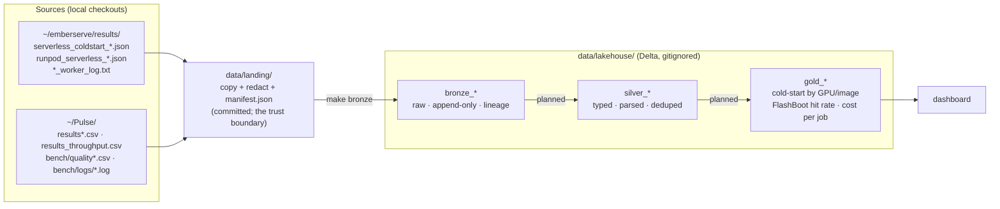

# serverless-lakehouse

A bronze → silver → gold (medallion) lakehouse over my own Runpod Serverless benchmark data: cold-start
timelines, load sweeps, per-request latencies, worker logs and LLM scoring-job results collected while
building [emberserve](https://github.com/ashwinsreedhar28/emberserve) (an LLM inference engine, formerly
*pagedserve*) and the Pulse scoring benchmark. Local PySpark + Delta Lake on an M1; nothing here needs a GPU.

The end state is a gold layer that answers: cold-start distribution by GPU and image, FlashBoot hit rate,
cost per job, and how emberserve compares to worker-vllm on the same endpoints.

**Status:** landing zone + bronze layer done. Silver and gold are designed below, not built.

## Architecture



Each arrow is one `make` target and one Python module, and every layer can be rebuilt from the one before
it. `data/landing/` is in git so a clone reproduces every table from `make bronze` alone; in a deployed
version `LANDING_DIR` would be an S3 prefix and nothing downstream would change.

## Quickstart (macOS, Apple Silicon)

```bash
brew install openjdk@17                      # Spark 3.5 runs on Java 11/17 (21 works for local mode)
export JAVA_HOME="$(brew --prefix openjdk@17)"; export PATH="$JAVA_HOME/bin:$PATH"   # brew's JDK is keg-only;
                                             # the Makefile also detects it, so this is only needed outside make
git clone https://github.com/ashwinsreedhar28/serverless-lakehouse && cd serverless-lakehouse
make setup                                   # .venv with pyspark==3.5.9, delta-spark==3.3.3
make hooks                                   # pre-commit secrets scan
make bronze RUN_LABEL=2026-10-02_initial     # landing → bronze Delta tables (first run fetches Delta jars from Maven)
make verify                                  # every landed file's rows are in its table, counted independently
make show                                    # rows / files / run_labels per table
```

`make land` re-extracts from `~/emberserve` (falls back to `~/pagedserve`) and `~/Pulse`; it is only needed
when the sources change. `FORMAT=parquet` runs the same code without the Delta extension, for sandboxes
that cannot reach Maven Central.

## Layout

```
Makefile                    setup · land · bronze · verify · show · check-secrets · hooks · test · clean
requirements.txt            pinned: pyspark 3.5.9, delta-spark 3.3.3 (these two move together)
lakehouse/
  config.py                 paths and table names
  redact.py                 credential patterns, shared by land and the pre-commit scan
  land.py                   extract: source checkouts → data/landing/ (+ manifest.json)
  spark.py                  one SparkSession builder (delta | parquet)
  bronze.py                 data/landing/ → bronze tables
  verify.py                 bronze row counts vs. an independent Python count of each landed file
  show.py                   what is in bronze
scripts/check_secrets.py    scan tracked/staged files; exit 1 on any hit
.githooks/pre-commit        refuses .env / data/lakehouse paths, then runs check_secrets --staged
tests/                      redaction behaviour; landing zone ↔ manifest consistency; no secrets landed
data/landing/               47 redacted source files + manifest.json (committed, 2.6 MB)
data/lakehouse/             Delta tables (gitignored, rebuildable)
```

## Sources

What is in each source today, from inspecting the files — not from memory of what the scripts write.

| source | files | what one record is | fields worth knowing |
|---|---|---|---|
| `emberserve/results/serverless_coldstart_*.json` | 13 | a cold-start series: header + 1–3 `runs[]`, each a `cold`/`warm` request pair | `delay_ms`, `execution_ms`, `worker_id`, `health_before`; newer files add `phases_s` (9–12 phases) and `timeline.marks` |
| `emberserve/results/runpod_serverless_*.json` | 10 | a load sweep: header + `args` + one run per request rate | `ttft/tpot/e2e` p50/p90/p99, `throughput_tok_s`; 4 files carry `records[]` (200 per run, 1,000 rows total); load-balancer files add `server_counters` |
| worker logs (`Pulse/bench/logs/*.log`, emberserve `*_worker_log.txt`) | 18 | one log line | three timestamp prefixes (console copy-paste, API ISO-8601, endpoint-logs table); payload mixes vLLM INFO, httpx, Runpod SDK JSON, tqdm bars |
| `Pulse/results.csv`, `results_v0.csv`, `bench/logs/results_runs1-3.csv` | 3 | one `coldstart.py` request | `kind` cold/warm, `delay_ms`, `exec_ms`, `gpu`, `workers_before`; v0 schema lacks `finish_reason`,`text`; v0 and runs1-3 are byte-identical |
| `Pulse/results_throughput.csv` | 1 | one `throughput.py` request | `label` (prefix_on/off), `concurrency`, `delay_ms`, `exec_ms`, `score` |
| `Pulse/bench/quality.csv`, `quality_batches.csv` | 2 | one scored article / one batch | 8 backend×model combos (ollama, claude, openrouter, runpod A40 / RTX A6000), `est_cost_usd`, `rate_*` |

Deliberately **not** ingested: `Pulse/bench/logs/quality_*.log` (quality.py stdout; every field is already a
row in `quality*.csv`), `Pulse/bench/.env`, `Pulse/bench/logs/gpu_per_cycle.txt` and `run_script_outputs.txt`
(hand-written notes → a curated seed table in silver), emberserve `*.server.log` (A100 pod sweeps, not
Serverless), `articles_50.json` (the scoring fixture).

## Layer schemas

### Bronze — built

Every table has four lineage columns:

| column | meaning |
|---|---|
| `ingested_at` | UTC timestamp of the ingest run (one instant per run) |
| `run_label` | batch tag passed to `make bronze` |
| `source_file` | landed path, relative to `data/landing/` |
| `source_sha256` | sha256 of that landed file (from the manifest, re-verified at read time) |

| table | one row is | rows | columns besides lineage |
|---|---|---|---|
| `bronze_coldstart_series` | one `serverless_coldstart_*.json` file | 13 | `kind mode endpoint label image note max_tokens idle_s n_runs summary_json` |
| `bronze_coldstart_runs` | one cold+warm run in such a file | 31 | same header + `run_index health_before_json cold_json warm_json` |
| `bronze_sweep_runs` | one request-rate run in `runpod_serverless_*.json` | 38 | `kind system server base_url model args_json run_index request_rate wall_s summary_json trace_json server_counters_json server_latency_json n_records` |
| `bronze_sweep_records` | one request, where the sweep saved them | 1,000 | `system run_index request_rate request_id arrival_s first_token_s finish_s prompt_tokens output_tokens success error` |
| `bronze_worker_log_lines` | one line of a worker log | 9,367 | `line_no raw_line` |
| `bronze_pulse_coldstart_requests` | one row of `results*.csv` | 102 | the 17 CSV columns, all `string`; v0-schema rows have null `finish_reason`,`text` |
| `bronze_pulse_throughput_requests` | one row of `results_throughput.csv` | 2,795 | the 17 CSV columns, all `string` |
| `bronze_pulse_quality_requests` | one row of `quality.csv` | 700 | the 27 CSV columns, all `string` |
| `bronze_pulse_quality_batches` | one row of `quality_batches.csv` | 14 | the 23 CSV columns, all `string` |
| `bronze_ingest_log` | one (run, table, file) append | 64 | `run_label table source_file source_sha256 rows ingested_at` |

Typing rule: CSV values stay strings; JSON scalars keep their JSON type (`max_tokens` is a long because the
file says `16`, not `"16"`); JSON objects are stored as compact JSON strings and exploded in silver.

### Silver — designed, not built

Typed, parsed, deduplicated; one row per *event*, keyed so gold can join.

- `silver_coldstart_requests` — union of `bronze_coldstart_runs` (exploded `cold_json`/`warm_json`) and
  `bronze_pulse_coldstart_requests` (typed), one row per Serverless request with `endpoint_id, worker_id,
  gpu, image, engine (emberserve|worker-vllm), is_cold, delay_ms, execution_ms, flashboot_hit`; v0/runs1-3 deduped.
- `silver_coldstart_phases` — `phases_s` exploded to (run, phase, seconds).
- `silver_sweep_summaries`, `silver_sweep_requests` — typed sweep runs (`request_rate` null → `inf`) and
  per-request latencies (`ttft_ms = first_token_s − arrival_s`, monotonic clock, so only differences are meaningful).
- `silver_worker_log_events` — the three timestamp formats parsed to one UTC `ts`, `worker_id` where present,
  `event_kind` (vllm_info | sdk_json | httpx | tqdm | other), the SDK JSON exploded.
- `silver_scoring_requests`, `silver_scoring_batches` — typed `quality*.csv` with `est_cost_usd` as decimal.
- `dim_gpu_placement` — hand-curated seed from `gpu_per_cycle.txt`: (run/cycle → GPU model, data center, price tier).

### Gold — designed, not built

- `gold_coldstart_by_gpu_image` — p50/p90/max `delay_ms`, n, by `gpu × image × engine`.
- `gold_flashboot_hit_rate` — share of cold requests with `delay_ms` under the FlashBoot threshold, by endpoint and day.
- `gold_cost_per_job` — `execution_ms × $/hr` of the GPU tier, plus scoring-job `est_cost_usd`, by backend.
- `gold_engine_comparison` — emberserve vs worker-vllm on the same GPU and model: cold `delay_ms`, warm `execution_ms`, sweep p99.

## Decisions

1. **Landing zone in git, lakehouse out of git.** The pipeline must be runnable by someone who is not me.
   `data/landing/` (2.6 MB, redacted, manifested) is that fixture; `data/lakehouse/` is derived and
   rebuildable. Threshold for moving landing to LFS or object storage: ~50 MB.
2. **Landing is a mirror; bronze is a ledger.** `make land` overwrites files and rewrites the manifest.
   History is bronze's job: append-only, every row stamped with `source_sha256`.
3. **Idempotency key = (source_file, source_sha256).** Re-running `make bronze` appends nothing. A changed
   file at the same path appends new rows beside the old ones. Two identical files at different paths both
   land (the source really has both); silver dedupes.
4. **Bronze flattens arrays, nothing else.** One row per `runs[]` / `records[]` element is a grain choice,
   not a transform — a one-row-per-file table with nested arrays is unqueryable. Nested objects stay JSON
   strings so a new phase name in a future file cannot break the schema (Delta `mergeSchema` is on for appends anyway).
5. **Spark reads the CSVs with an explicit all-string schema** (`multiLine`, `escape='"'`, `FAILFAST`),
   and `make verify` recounts every file with Python's `csv`/`json`/`splitlines` — an independent oracle,
   so the pipeline is not grading itself.
6. **No partitioning in bronze.** Tables are KB–MB; partition directories would cost more than they save.
   Revisit at silver if a date partition helps the dashboard.
7. **Identifiers are not secrets.** Endpoint IDs, worker IDs and `api.runpod.ai/v2/<id>` URLs stay in the
   data: every call needs the Bearer key, and the same IDs are already public in emberserve's `results/`.
8. **Version pins move together.** `pyspark==3.5.9` ↔ `delta-spark==3.3.3`; Delta 3.3 is built for Spark 3.5.
9. **`request_rate: null` is kept null** in bronze (it means the unbounded/“inf” rate; Python's `json`
   wrote `null`). Mapping it to `inf` is a silver rule. Likewise the `NaN` literals two sweep files contain.
10. **pagedserve → emberserve.** The engine repo is being renamed; this repo uses the new name for the
    source root and falls back to `~/pagedserve` locally. File names and values inside the data keep the old
    name — bronze does not rewrite source content.

## Secrets

Worker logs can contain whatever the container printed, and sweep `args` carry an `api_key` field, so:

- `lakehouse/redact.py` holds one pattern list (HF `hf_…`, Runpod `rpa_…`, `sk-…` keys, GitHub, AWS,
  `Bearer …`, and `key: value` forms where the key is `api_key|secret|token|password|authorization`).
  `make land` applies it to every byte that enters the repo and records per-file redaction counts in the
  manifest (currently 0 — the sources were already clean; the `api_key` in sweep args is `"<redacted>"` at source).
- `.env` and `*.env` are refused by name in `land`, `.gitignore` and the pre-commit hook, whatever they contain.
- `make check-secrets` scans every tracked file with the same patterns; the pre-commit hook (`make hooks`)
  runs it on staged content, so a future log with a token in it cannot be committed.
- `tests/test_landing.py` asserts the committed landing zone matches its manifest byte-for-byte and contains no match.
